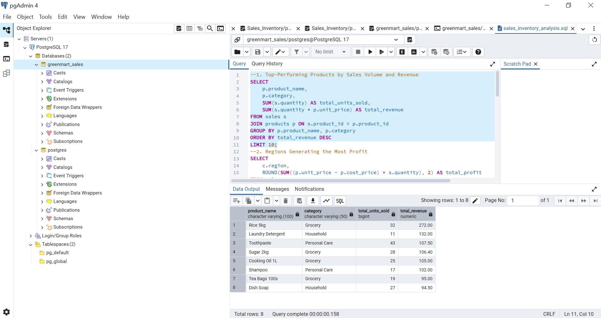
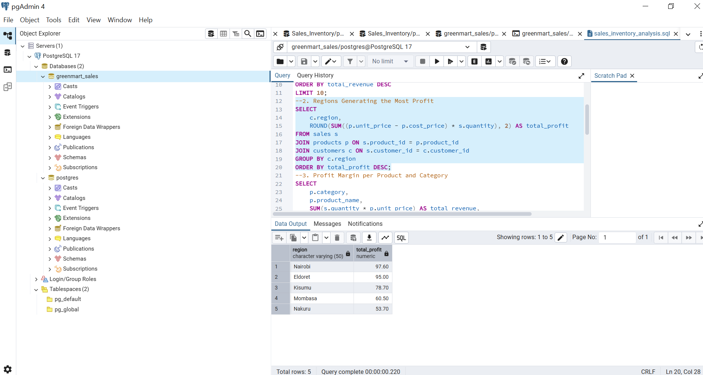
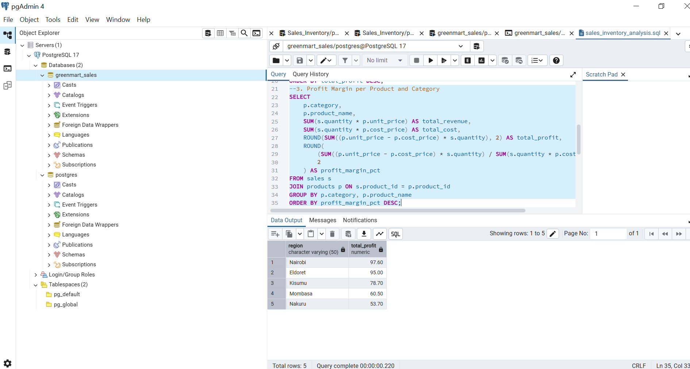
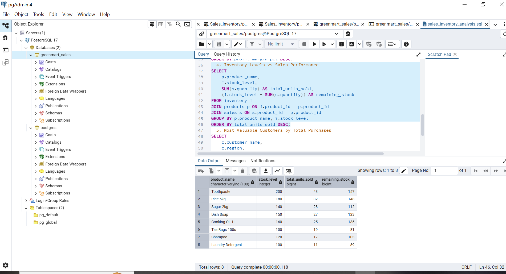
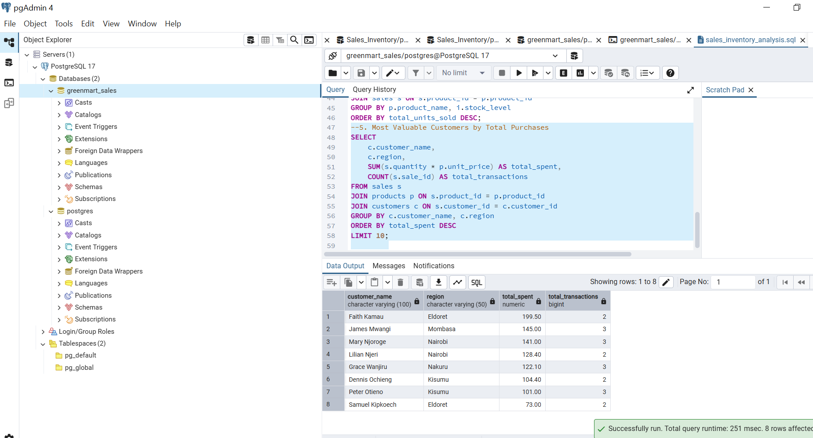

# 🧾 GreenMart Sales & Inventory SQL Analysis

This project showcases how SQL can be used to analyze business performance through sales, customer, and inventory data.  
Using PostgreSQL, the project explores product profitability, regional performance, and customer insights — helping businesses make data-driven decisions.  
It highlights key SQL concepts such as joins, aggregations, and profit margin calculations.

> 🗄️ Tools Used: PostgreSQL · pgAdmin · SQL

## 📘 Project Title
**Sales and Inventory Analysis Using SQL**
## 📸 SQL Query Results

### 1️⃣ Top-Performing Products

### 2️⃣ Profit by Region

### 3️⃣ Profit Margin by Product and Category

### 4️⃣ Inventory vs Sales Performance

### 5️⃣ Most Valuable Customers

## 💡 Key Insights
- **Rice 5kg, Laundry Detergent**, and **Toothpaste** generated the highest revenue.
- **Nairobi** and **Eldoret** were the most profitable regions.

- **Toothpaste (108%)** and **Dish Soap (75%)** had the best profit margins.

- **High-selling products** showed efficient inventory turnover.
- **Faith Kamau** and **James Mwangi** were the top customers by total purchases.
